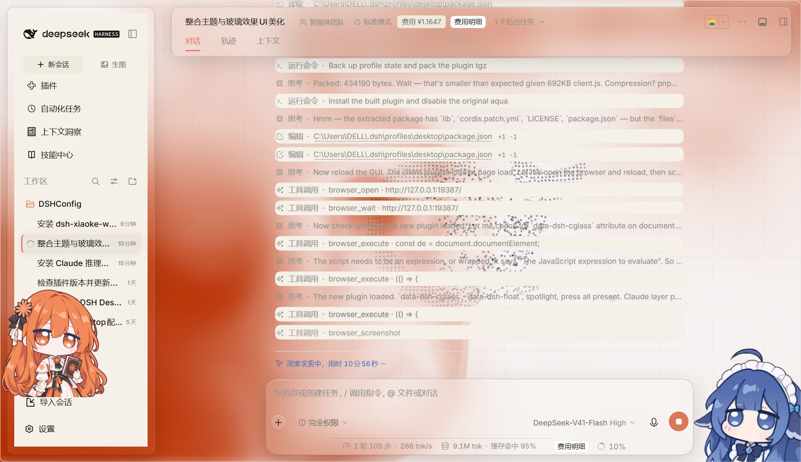
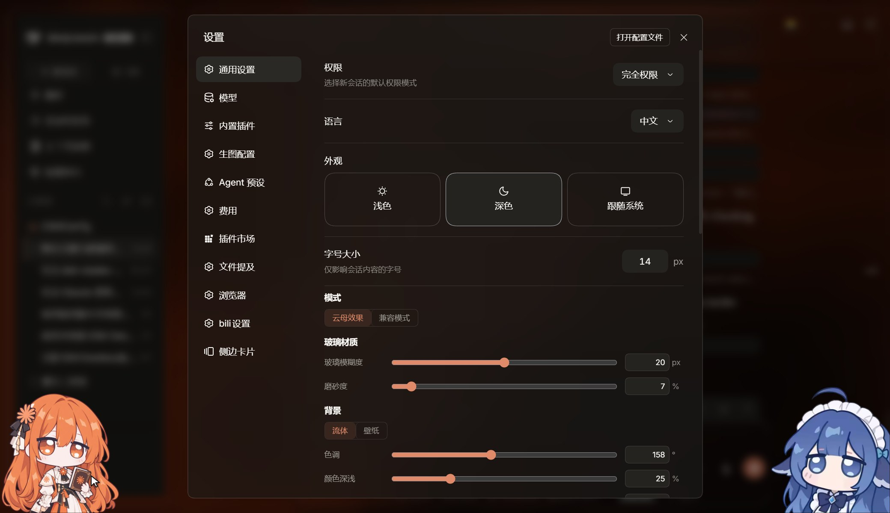

# Claude Glass

**克劳德玻璃** —— 把 [dsh-claude-theme](https://github.com/aklnaaw/dsh-claude-theme) 的暖米色编辑排版语言，装进
[dsh-client-ui-aqua](https://github.com/WYH66666666/DSH-Transparent-UI-Plugin) 的玻璃材质与动效引擎里。

一句话：**Claude 的颜色与版式，aqua 的玻璃与动画。**




---

## 1. 它整合了什么

| 来源 | 拿过来的东西 |
| --- | --- |
| **dsh-claude-theme** | 278 个 `--dsw-*` 颜色令牌（`#faf9f5` 画布 / `#d97757` 珊瑚 / `#181715` 暖黑深色）、完整排版阶梯、`--cl-*` 调色板钩子、圆角阶梯（8 / 12 / 16 / 26）、`claude.ai` 的卡片语言 |
| **dsh-client-ui-aqua** | 流体着色器背景、玻璃/云母材质、小鱼与气泡等环境装饰、鼠标辉光、悬停下压、入场动画、壁纸（图/视频）层、完整的设置界面 |

字体也从 claude-theme 原样搬来（四份 woff2 以 base64 内联进 bundle）：
**Newsreader** 衬线正文 / **Inter** 界面外壳 / **JetBrains Mono** 代码。

## 2. 与原版 aqua 的差异

不是简单换色，`build.mjs` 对 aqua 的预构建 bundle 做了 **359 处可复现的字面量替换**：

1. **调色板**：`AQUA_TOKEN_OVERRIDES` 整体换成从 `claude/skin.css` 解析出的 Claude 令牌；
   `COMPAT_SURFACE_OVERRIDES` 保留上游的 **21 个表面键名**，但值改成**实心**的 Claude 色（见 §5.3 (c)）。
2. **冷蓝硬编码**：`aqua.module.css` 里写死的 `#132d53`(19 处) / `#94b4dc`(18 处) / `#6e9be8` / `#96bef5`
   等描边、辉光、文字、环境渐变，逐条映射到 Claude 的暖色（`#141413` / `#faf9f5` / `#d97757` / `#e8dfcd`）。
3. **圆角**：`14 / 20 / 24 / 10` → Claude 阶梯 `12 / 16 / 26 / 8`。
4. **排版**：aqua 自带的 Space Grotesk 被换成 `var(--cl-serif)` / `var(--cl-sans)`；
   `fonts.module.css` 整块换成 Newsreader + Inter + JetBrains Mono。
5. **追加 `claude-layer.css`**：aqua 表达不了的 Claude 语言——衬线阅读列、标题 weight 400、
   工具调用卡片、焦点环、滚动条。
6. **命名空间隔离**：`dsh-aqua*` → `dsh-cglass*`、`dsh.ui-aqua.*` → `dsh.claude-glass.*`，
   所以它可以和原版 aqua 并存而不打架。
7. **默认色调**：`fluidHue` 320（青绿）→ **158**。aqua 的辉光色是 `(fluidHue + 217) % 360`，
   158 正好落在 15° = Claude 珊瑚。
8. **侧栏永不下压**（`spotlight.ts` 的 `tiltable()`，见 §5.2）：上游只在「有 `[role=dialog]` 打开」
   时才拒绝给侧栏列写 3D 倾斜 transform，范围比它自己注释里写的「the sidebar NEVER tilts」窄，
   于是在 Windows 标题栏模式下把「收起侧边栏」按钮从 `(12,6)` 顶到 `(24,55)`。
9. **兼容模式的三条根治**（见 §5.3）：`COMPAT_SURFACE_OVERRIDES` 保留上游的 21 个键名、
   但值改成**实心**（不再让 `--dsw-alias-bg-base` 等大面积令牌半透明化，滑出的右侧栏面板不再变成薄纱，
   也不再让 55% 的 `bg-layer-1` 把每条对话行都变成薄纱）；
   兼容模式的通配 `backdrop-filter:blur(12px)` 从 `[class*=card|bubble|panel|popover|dropdown]`
   收敛到「小浮层」`[role=menu|tooltip|listbox]` / `[popover]`
   （**不能**把 `[role=dialog]` 或 `[data-shell-overlay]` 放进去：后者是铺满 frame 的
   overlay 层，会让整个应用发糊）。

**刻意没有做的事**（继承 claude-theme 踩过的坑）：不给 `tool-call` / `turn-process` / `workflow-run`
加 `overflow:hidden`——这些节点承载工具输出与思考文本，裁切只会丢信息。

## 3. 安装

```powershell
# 1) 放进 profile 的 vendor 目录
copy dsh-claude-glass-1.0.0.tgz "$env:USERPROFILE\.dsh\profiles\desktop\vendor\"

# 2) 解包到 node_modules
tar -xzf "$env:USERPROFILE\.dsh\profiles\desktop\vendor\dsh-claude-glass-1.0.0.tgz" `
    -C "$env:USERPROFILE\.dsh\profiles\desktop\node_modules\dsh-claude-glass" --strip-components=1
```

然后编辑 `%USERPROFILE%\.dsh\profiles\desktop\package.json`：

```jsonc
{
  "dependencies": {
    // 原来是 dsh-client-ui-aqua，换成这一行
    "dsh-claude-glass": "file:vendor\\dsh-claude-glass-1.0.0.tgz"
  },
  "dsh": {
    "profile": {
      "bundles": [
        // 把 "dsh-client-ui-aqua" 换成 "dsh-claude-glass"
        "dsh-claude-glass"
      ]
    }
  }
}
```

> **重要**：两套引擎不要同时挂载——它们会各自往页面里塞一块流体画布，而且
> `settings.plugin.item` 的槽 key 都是 `aqua`。要么只留 Claude Glass，要么把
> `node_modules\dsh-client-ui-aqua` 改名成 `.dsh-client-ui-aqua.off`。

重启 DSH 宿主（**不要一边跑一边改 profile**，宿主会中途重载，正在用的内置浏览器会掉线）。

## 4. 设置

`设置 → 通用设置` 往下就是 Claude Glass 自己的控件（沿用 aqua 的界面，标题已改为「Claude 玻璃」）：

- **模式**：云母效果（浮起玻璃卡）/ 兼容模式（只有 `backdrop-filter`，保持原版版式）
- **玻璃材质**：玻璃模糊度 0–40px、磨砂度 0–100%
- **背景**：流体（着色器）/ 壁纸（可上传图片或视频）
- **色调**：0–360°，**默认 158 = Claude 珊瑚**
- **颜色深浅**：0–100%
- 以及小鲸鱼、小鱼、网状交互、鼠标辉光、悬停下压等开关（均在 `设置` 内）

## 5. 从源码重新构建

构建需要**两个上游输入**，它们**不随本仓库分发**（一个是 AGPL 的预构建 bundle，
一个体积不小的皮肤资产）：

| 输入 | 是什么 | 默认查找位置 |
| --- | --- | --- |
| `BASE` | `dsh-client-ui-aqua@1.3.1-patch.4`（含 `lib/client.js`） | `..\dsh-client-ui-aqua` |
| `CLAUDE` | `dsh-claude-theme` 的 `claude/` 皮肤目录（含 `skin.css`） | `..\dsh-claude-theme\claude` |

两种指定方式（任选其一）：

```powershell
cd dsh-claude-glass

# A) 命令行参数
node build.mjs --base ..\dsh-client-ui-aqua --claude ..\dsh-claude-theme\claude

# B) 环境变量
$env:DSH_AQUA_BASE        = "D:\path\to\dsh-client-ui-aqua"
$env:DSH_CLAUDE_THEME     = "D:\path\to\dsh-claude-theme\claude"
node build.mjs
```

两个输入任一缺失，`build.mjs` 会打印探针路径与设置方法后以退出码 2 结束。

```powershell
node build.mjs                                            # 任何锚点失配都会以非零退出码 + BUILD PROBLEMS 中止
node verify.mjs dist/dsh-claude-glass/lib/client.js       # 必须带路径参数
node pack.mjs                                             # 出 tgz（pnpm 优先，退回 npm）
node pack.mjs --dest "$env:USERPROFILE\.dsh\profiles\desktop\vendor"   # 顺带投递到 profile
```

也可以走 `package.json` 的脚本：`npm run build` / `npm run verify` / `npm run pack` /
`npm run release`（三连）。`build.mjs` 的产物写到 `dist/dsh-claude-glass`。

> `pack.mjs` 会自动探测可用打包器（`DSH_PACK_CMD` → `pnpm` → `npm`），所以
> 在没装 pnpm 的机器上也能出包；若 pnpm 只是不在 `PATH` 里，用
> `$env:DSH_PACK_CMD = "<...>\pnpm\bin\pnpm.cjs"` 指过去即可。

### 5.0 构建可复现的前提

`build.mjs` 靠在 aqua bundle 里做**字面量子串匹配**来定位每个改动点，并**逐个统计出现次数**，
所以：

- **不要让检出过程把行尾改成 CRLF**——`.gitattributes` 已固定 `* text=auto eol=lf`；
- **不要手工编辑 `dist/`**——它每次构建都会被整目录重建；
- 换 aqua 基线版本时锚点几乎必然失配，此时按 `BUILD PROBLEMS:` 报出的锚点原文更新
  `build.mjs` 里的常量即可（每条替换都自带 `expect=` 期望站点数，失配不会静默通过）。

### 5.1 侧栏按钮回归守卫（`verify.mjs` 末尾）

`verify.mjs` 除了计数校验，还会守护 §2 提到的**侧栏包含块回归**：任何给
`[class*=sidebarCol]` 规则加回 `backdrop-filter`（除 `backdrop-filter:none` 外）的构建
都会以 `GUARD FAILURES` + 退出码 1 失败。

原因：`backdrop-filter` 会让侧栏列成为其后代
`position:fixed` 元素的**包含块**，而核心 0.2.0-rc.2 在 Windows 标题栏模式下正是把
「收起侧边栏」按钮钉成 `position:fixed`（`[data-windows-titlebar] ._2H3hWW_toggle{left:12px;top:calc((var(--dsh-windows-titlebar-height) - 28px)/2)}`）。
包含块一变，按钮就落进侧栏卡片内部；一旦收起，
列宽归零且该列自带 `overflow:hidden`，按钮被裁掉，完全不可见、不可点。
（该修复原本是 aqua `1.3.1-patch.4` 基线自带的，本插件继承并加了守卫。）

实测复核（2026-10-06，用本仓库自带的 `tools/toggle-repro/` 这套真 Electron + 真核心 CSS 台架）：

| 被检包 | 展开时 rect | 收起时 rect | 标题栏位 (26,20) 命中 | 收起时自身中心命中 | `colBackdrop` |
| --- | --- | --- | --- | --- | --- |
| 上游 aqua（对照，有 bug） | (24.7, 58.7) | (24.7, 58.7) | `BynINW_frame` ✗ | `BynINW_centerCol` ✗ | `blur(14px)` |
| patch.4 基线 | (12, 6) | (12, 6) | `toggle` ✓ | `toggle` ✓ | `none` |
| **本插件（Claude Glass）** | **(12, 6)** | **(12, 6)** | **`toggle` ✓** | **`toggle` ✓** | **`none`** |

另有运行期全 DOM 复核：float 模式与 `data-dsh-compat` 兼容模式下，分别对 39 个
`position:fixed` 元素回溯祖先链，**没有任何一个祖先带非 none 的 `backdrop-filter`**。

> 注意：这两项复核都必须在真 Electron 下跑（本仓库 `tools/toggle-repro/` 就是那套台架：
> `main.js` + 从核心布局／侧栏 CSS 抽出的 `core-layout-css.txt` / `core-sidebar-css.txt`）。
> 若直接 `electron.exe main.js` 报
> `Cannot find module 'electron'`，是因为本 Harness 的环境里带着
> `ELECTRON_RUN_AS_NODE=1`，需先 `Remove-Item Env:ELECTRON_RUN_AS_NODE`；
> 且 Electron 是 GUI 子系统程序，`console.log` 不会回到当前控制台，
> 要用 `Start-Process -RedirectStandardOutput` 收结果：

```powershell
Remove-Item Env:ELECTRON_RUN_AS_NODE -ErrorAction SilentlyContinue
$el = "$env:USERPROFILE\.dsh\profiles\desktop\node_modules\electron\dist\electron.exe"
Start-Process -FilePath $el -Wait -NoNewWindow -RedirectStandardOutput out.json -ArgumentList `
  "tools\toggle-repro\main.js", `
  "<upstream-aqua>\lib\client.js", `
  "dist\dsh-claude-glass\lib\client.js"
Get-Content out.json | ConvertFrom-Json | ConvertTo-Json -Depth 8   # 对照 before_aqua_src / after_aqua_patched
```

### 5.2 侧栏倾斜守卫（2026-10-06 追加的第二处兼容修复）

§5.1 修掉的是**静态 CSS** 造成的包含块（`backdrop-filter`）。还有第二条**运行期**路径能把
侧栏列变成包含块：aqua 的「悬停下压」效果（设置里的**按压泡泡**，`data-dsh-cglass-press`）
会给指针下的每个 spot 现写一条 inline transform：

```js
spot.style.transformOrigin = `${local.left + local.width / 2}px ${local.top + local.height / 2}px`;
spot.style.transform = `perspective(800px) rotateX(${tiltMax * -2 * dy}rad) rotateY(${tiltMax * 2 * dx}rad) scale(1.01)`;
```

而侧栏列本身就是个 spot（`data-dsh-cglass-spot`），所以**鼠标一进侧栏，那一列就被倾斜 ≈1°**。
`spotlight.ts` 的注释其实写明了「the sidebar NEVER tilts … a running transform would re-anchor it」，
但实现的判据是：

```js
if (spot.matches("[class*=\"sidebarCol\"]") && document.querySelector("[role=\"dialog\"]") !== null) return false;
```

——只在**有对话框打开**时才拒绝。Windows 标题栏模式下被重新锚定的是「收起侧边栏」按钮
（`[data-windows-titlebar] ._2H3hWW_toggle`，`position:fixed; left:12px; top:6px`），
它跟对话框毫无关系，于是照样被带跑。

**修法**：把 `tiltable()` 的判据改成无条件拒绝侧栏列（`build.mjs` 第 9 步，1 处替换）。
**只去掉倾斜，保留辉光**——辉光走的是另一道闸门 `data-dsh-cglass-spotlight`，不受影响。

实测（`http://127.0.0.1:19387`，给页面强加 `data-windows-titlebar` 以模拟桌面，再对侧栏内的
行派发 `pointerover`/`pointermove`，等 400 ms 读结果）：

| 被检包 | 侧栏列 `style` 属性 | 侧栏列 computed `transform` | 按钮 rect | 悬停后是否稳定 |
| --- | --- | --- | --- | --- |
| 修复前（上游 aqua / patch.4 同样） | `transform-origin: 128px 368px; transform: perspective(800px) rotateX(-0.00175951rad) rotateY(-0.0120313rad) scale(1.01);` | `matrix3d(1.00993, …, 1.01, …)` | (12,6) → **(24,55)** | ✗ 跟着鼠标跑 |
| **本插件（Claude Glass）** | `null`（一个 inline 属性都没写） | `none` | (12,6) → **(12,6)** | ✓ |

同时复核了「没有误伤」：侧栏列的 `data-dsh-cglass-glow` 仍然拿到
`radial-gradient(180px at 128px 37px, var(--dsh-cglass-spot-color, …))`；标题栏卡片
（`Dc7zOa_header`）悬停后仍写出 `perspective(800px) rotateX(6.9e-05rad) rotateY(0.00876629rad) scale(1.01)`，
离开 500 ms 后 inline style 归空；收起/展开走了一轮：`0px 1386px 0px`（按钮仍在视口内、
中心命中自身）↔ `280px 1106px 0px`。

> 为什么网页端看着没事：只有在 `[data-windows-titlebar]` 下核心才会把该按钮钉成
> `position:fixed`；网页态按钮是侧栏内的行内元素，包含块换了位置也不动。
> 这也解释了「只能在桌面端复现」。

`verify.mjs` 里加了对应的守卫（`--- sidebar tilt guard ---`）：`tiltable()` 里必须存在无条件语句
`if (spot.matches("[class*=\"sidebarCol\"]")) return false;`、且不得再有 `[role="dialog"]` 判据，
否则 `GUARD FAILURES` + 退出码 1。对照：上游 aqua 跑同一守卫 → `BAD unconditional=false dialogGated=true` / exit 1。

### 5.3 兼容模式的三处修复（2026-10-06 追加的第三组兼容修复）

现象：切到**兼容模式**后，对话区右半边被一块乳白色「白块」盖住、正文在那里被硬切；
**打开右侧栏就正常**；桌面窗口与浏览器弹出窗口都能看到，普通网页标签页不明显。
第二轮又追加一条实测反馈：**「方向反了，现在兼容模式完全糊掉了」**——整块界面像蒙了一层雾。

根因有三条，都出在兼容模式，且都在本插件这一侧：

**(a) `--dsw-alias-bg-base` 不该进兼容模式的半透明表层。**
DSH 核心把「已关闭」的右侧栏面板以 `position:absolute; inset:0 0 0 -624px` 滑出到画面右半
（父容器 `BynINW_rightbarCol` 宽 0、`overflow:visible`，所以它照样绘制）。
该面板内部的 dockkit pane（`_tabHost_6nhg2 … _pane_6nhg2`）画的背景就是 `var(--dsw-alias-bg-base)`：

```
SECTION._tabHost_6nhg2_162 _pane_6nhg2 [762,40 624x760]
  bg = color(srgb 0.980392 0.976471 0.960784 / 0.72)   ← 72% 半透明
```

切到「流体/云母」时这个令牌是不透明的 `#faf9f5`，所以滑出的面板只是一块**实心**奶油色空白，
看不出问题；兼容模式一旦把它做成 72% 半透明，面板就变成一层**薄纱**，正文从底下透出来 —— 这就是「白块」。
决定性实验：给该面板 `visibility:hidden !important` 后白块完全消失、正文清晰铺满全宽。

上游 aqua 的 `COMPAT_SURFACE_OVERRIDES` **刻意只覆盖 21 个「浮层/行内」令牌**
（menu / selector / tip / bubble / tooltip-bg / toast-bg / input-major / login-input /
bg-layer-1..3 / bg-overlay / bg-module-platform / bg-multi-select 与 markdown 的
code-block / banner / inline-code / citation / tag / placeholder，alpha 0.45–0.88），
**明确不含** `--dsw-alias-bg-base`（画布）、`--dsw-alias-bg-mask-*`（遮罩）、
`--dsw-specific-sidebar-fill`、`--dsw-alias-bg-skeleton`。

上一版是我用一条宽泛的正则自己拼的 24 个键：**多**了上面四个「大面积」令牌（→ 白块），
**少**了 markdown / tooltip 那一组（→ 兼容模式下代码块与提示条不再有玻璃感）。
**修法**：改成「镜像上游的键表」——`readCompatSurfaceKeys()` 从上游 bundle 里把 21 个键抄出来，
逐个换成对应的 Claude 色（这 21 个键在 `claude/skin.css` 里全部存在，21/21 实测）。

**(b) 兼容模式的通配 `backdrop-filter` 太宽。** 上游原文：

```css
[data-dsh-compat] [role=menu],[data-dsh-compat] [role=tooltip],
[data-dsh-compat] [class*=card],[data-dsh-compat] [class*=bubble],
[data-dsh-compat] [class*=panel],[data-dsh-compat] [class*=popover],
[data-dsh-compat] [class*=dropdown]{backdrop-filter:blur(12px)}
```

`[class*=…]` 在这个 DOM 里的命中面完全失控——实测 `[class*=card]` 命中 16 个
（含 15 个 `md-code-block` 与 composer 卡）、`[class*=bubble]` 命中 4 个、
`[class*=panel]` 命中 **22 个**（连 `svg._2H3hWW_panelIcon`、`NAV._2H3hWW_panelList`、
`BUTTON._2H3hWW_panelRow`、`SPAN._2H3hWW_panelTitle` 这种纯文字 span 都中），
其中就包括上面那块滑出的右侧栏面板。

**修法**：收敛到真正「小而瞬时」的浮动层 ——

```css
[data-dsh-compat] [role=menu],[data-dsh-compat] [role=tooltip],
[data-dsh-compat] [role=listbox],[data-dsh-compat] [popover]{backdrop-filter:blur(12px)}
```

> **踩过的坑**：第一版收敛时把 `[role=dialog]` 和 `[data-shell-overlay]` 也列了进去，
> 结果**整个应用都糊了**——DSH 的 `BynINW_overlayLayer` 带着 shell-overlay 钩子、
> 铺满整个 frame，任何浮层一打开它就跟着被 `blur(12px)`。
> 设置对话框本身也已经是全尺寸表面并且自带不透明底色。
> 所以这里**只留「小浮层」**：菜单 / 提示条 / 列表框 / 原生 popover。
> `verify.mjs` 的守卫现在会同时拦 `[class*=…]` 与 `[role=dialog]` / `[data-shell-overlay]`。

**(c) 兼容模式的表面层必须实心，不能照抄上游的 alpha。**
上游给这 21 个表面令牌配的是 0.45–0.88 的 alpha（`rgba(..., 0.45~0.6)`），
那是为**去饱和的青色流体**调的；换到 Claude 的暖色 + 珊瑚流体之后，每一层表面都变成
盖在流体上的一层薄纱，**整块界面发糊**。实测 `getComputedStyle(document.body)` 里
本插件的 21 个兼容表面令牌全是 `color-mix(...)`：

```
--dsw-alias-bg-layer-1:  color-mix(in srgb, #f5f0e8 55%, transparent)
--dsw-alias-bg-layer-2:  color-mix(in srgb, #efe9de 50%, transparent)
--dsw-alias-bg-layer-3:  color-mix(in srgb, #e8e0d2 45%, transparent)
--dsw-alias-bg-overlay:  color-mix(in srgb, #faf9f5f7 60%, transparent)
--dsw-alias-markdown-code-block: color-mix(in srgb, #f5f0e8 50%, transparent)
--dsw-specific-bubble:   color-mix(in srgb, #faf9f5 55%, transparent)
--dsw-specific-menu:     color-mix(in srgb, #ffffff 60%, transparent)
--dsw-alias-toast-bg:    color-mix(in srgb, #252320 85%, transparent)
--dsw-alias-tooltip-bg:  color-mix(in srgb, #141413 88%, transparent)
```

其中 `--dsw-alias-bg-layer-1`（55%）被**每一条对话行**共用
（实测 `DIV.xz4KEq_flowItem` 的 `background = color(srgb 0.960784 0.941176 0.909804 / 0.55)`），
侧栏与卡片也读它 —— 珊瑚流体从每一层表面下透出来，就是「完全糊掉了」。

页面内对照实验（注入 `body{--x:#hex;}` 把这 21 个令牌改成纯色）：面板 / 侧栏 / 对话行立刻实心清爽，
右侧只余画布本身的流体渐变。**因此定案：兼容模式的表面层一律实心**——
键表照抄上游（键是设计决策），alpha 不照抄（值是配色决策），
生成时直接写入 Claude 的纯色，不再产生任何 `color-mix(..., transparent)`。
兼容模式本来就是「平板、无云母」的安全模式，实心才是它该有的样子。

`verify.mjs` 为这三条各加了守卫：

- **compat blur scope guard**：全 bundle 只许有一处 `backdrop-filter:blur(12px)`，
  且其选择器里出现任何 `[class*=…]`、`[role=dialog]`、`[data-shell-overlay]` 即失败。
- **compat solid-surface guard**：`COMPAT_SURFACE_OVERRIDES` 里不得出现
  `--dsw-alias-bg-base` / `--dsw-alias-bg-mask` / `--dsw-specific-sidebar-fill` / `--dsw-alias-bg-skeleton`，
  不得出现任何 `color-mix` / `transparent`（即一律实心），键数少于 10 也算失败。

> 排查提示一：`document.elementsFromPoint` 会跳过 `pointer-events:none` 的覆盖层，
> 判断「谁盖住了谁」必须自己按 rect + computed style 遍历。
> 排查提示二：注入覆盖样式后要**修完再断言**——只把 blur 去掉，白块仍在（blur 只是加重因素），
> 必须看那个滑出面板**自身**的背景色是不是变透明了。
> 排查提示三：页面内注入 `<style>` / inline style 会污染后续对照，比较截图前先重载。

## 6. 仓库布局

```
dsh-claude-glass/
├─ build.mjs                 构建脚本：解析两个上游输入 → 改写 aqua bundle → 生成整个包
├─ verify.mjs                校验：字面量计数 + 两处侧栏回归守卫（必须传 bundle 路径）
├─ pack.mjs                  打包：探测 pnpm/npm，出 tgz，可 --dest 投递
├─ src/
│  └─ claude-layer.css       手写的 Claude 版式层（追加到 aqua 主样式表末尾）
├─ tools/
│  └─ toggle-repro/          §5.1 侧栏包含块缺陷的真 Electron 台架（真核心 CSS）
│     ├─ main.js             `electron main.js <bundleA> <bundleB>`，输出 JSON 对照
│     ├─ core-layout-css.txt 从 dsh-client-ui-layout 抽出的核心 CSS
│     └─ core-sidebar-css.txt 从 dsh-client-ui-sidebar 抽出的核心 CSS
├─ licenses/
│  └─ dsh-claude-theme.txt   MIT + SIL OFL 1.1 全文 + 四款字体署名
├─ shots/                    README 用的截图
├─ assets/
│  └─ claude-tokens.json     从 skin.css 解析出的令牌表（生成物，已 gitignore）
├─ CHANGELOG.md              依赖清单、上游既有修复、本插件的每一次改动
├─ NOTICE                    四段式第三方声明
├─ LICENSE                   AGPL-3.0-only 全文（= aqua 基线的许可原文）
├─ dist/                     构建产物（已 gitignore）
└─ package.json              仅用于装脚本，非发布包
```

真正的发布包由 `build.mjs` 生成在 `dist/dsh-claude-glass/`，它的 `package.json`
才带 `dsh.bundle.patch` / `dsh.client` 等 DSH 需要的字段。

## 7. 许可

| 部分 | 许可 | 全文 |
| --- | --- | --- |
| **本整合（整体）** | **AGPL-3.0-only** | `LICENSE` |
| 玻璃材质、动效引擎、设置界面、运行期代码 | AGPL-3.0-only，来自 `dsh-client-ui-aqua` 1.3.1-patch.4 | `LICENSE`（同一份 AGPL 全文） |
| 调色板、排版阶梯、版式语言 | MIT，Copyright (c) 2026 dsh-claude-theme contributors | `licenses/dsh-claude-theme.txt` |
| Newsreader / Inter / JetBrains Mono 四份 woff2 | SIL OFL 1.1 | 同上（含字体署名与完整 OFL 正文） |
| 运行期 peer 依赖（React、cordis、`@deepseek-ai/*`） | 各自上游许可，不随包分发 | `package.json` 的 `peerDependencies` |

**为什么整体必须是 AGPL-3.0-only**：本包分发的是 `dsh-client-ui-aqua` 的
`lib/client.js` 的**修改版本**（预构建 bundle，无 TypeScript 源码），因此它是
AGPL-3.0-only 作品的衍生物。所有修改都是可复现的：清单见 `CHANGELOG.md`，
程序化说明见生成包 `package.json` 里的 `dshCompatPatch`。

分发出去的包同时带上 `NOTICE`（四段式第三方声明）与整个 `licenses/` 目录。
`LICENSE` 与 `NOTICE` 在**仓库根**也各有一份：`LICENSE` 放在仓库根，GitHub 才能
在仓库页上识别出 AGPL-3.0；`build.mjs` 是把它和 `NOTICE` 从仓库根拷进 `dist/`，
而不是现写文本。

非官方整合构建，与 DeepSeek、Anthropic 均无隶属关系；「Claude」仅指
`dsh-claude-theme` 所复刻的那套视觉语言。

## 8. 发布

已发布：<https://github.com/barryjohnson61/dsh-claude-glass>（public，分支 `main`）。

`dist/`、`*.tgz`、`assets/claude-tokens.json` 已在 `.gitignore` 里，
所以推上去的只有源码、文档、许可全文与截图。

后续更新：

```powershell
git add -A
git commit -m "<说明>"
git push
```

改完记得跑一次 `git status` 确认工作区干净；`LICENSE`（AGPL 全文）与
`licenses/dsh-claude-theme.txt`（MIT + OFL）承担随附义务，两者都必须留在仓库里。
